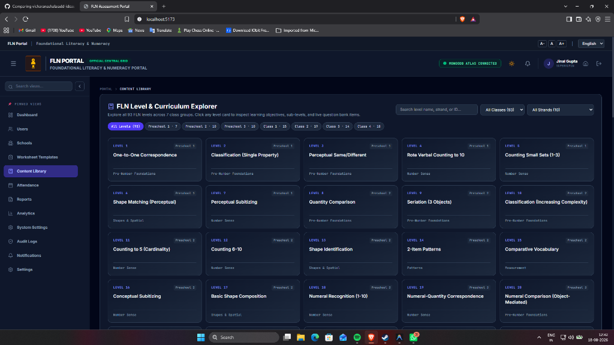
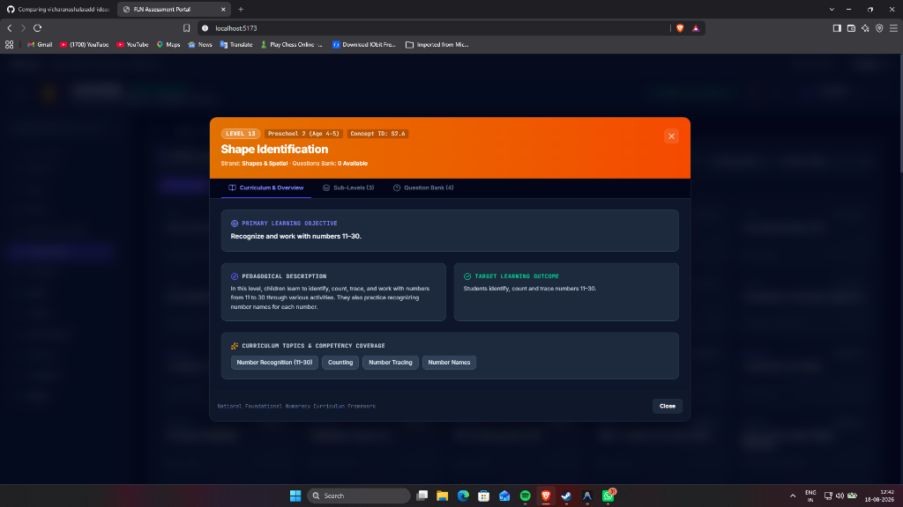
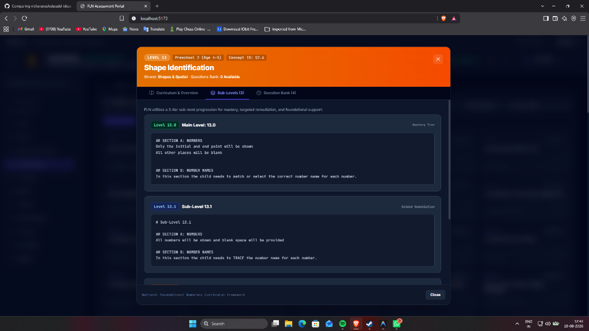
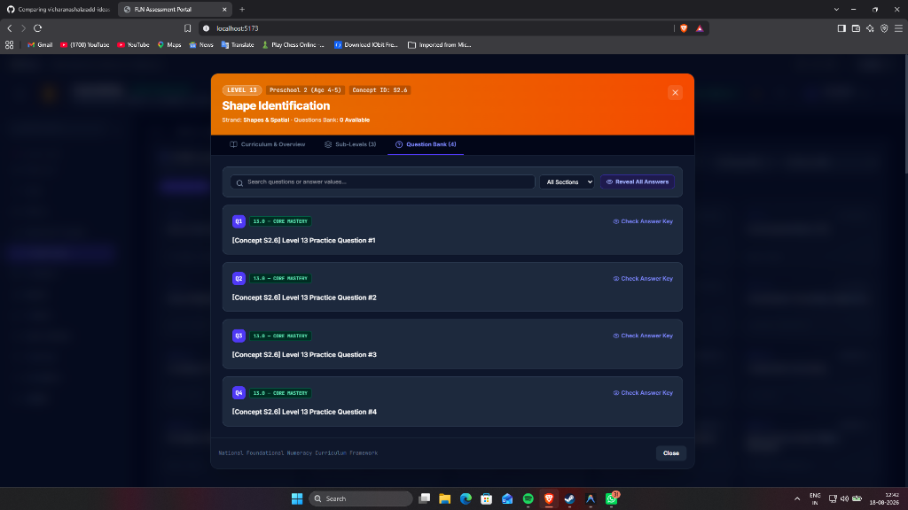

# Proposal: FLN Content Library & 93-Level Curriculum Browser

## Summary
Add an interactive curriculum browser so teachers and administrators can explore all 93 FLN levels, view learning outcomes, and preview question bank items directly in the app.

## Why this is needed
- The 93 FLN competency levels and sub-levels existed only as raw markdown files on disk.
- Teachers had to manually browse folders to see what concepts a level taught or what the sub-levels meant (`.0` Core Mastery, `.1` Guided Remediation, `.2` Concrete Support).
- There was no quick way to preview questions or diagrams before generating student worksheets.

## What was built
1. **Dynamic Markdown Parser (`backend/src/routes/content.ts`)**:
   - Parses the `FLN Levels Structure/` directory on the fly.
   - Extracts level titles, objectives, learning outcomes, and sub-level notes.
   - Merges questions and SVG illustrations from `data/questionBank.json`.
2. **Interactive UI (`LevelDetailModal.tsx` & `PanelViews.tsx`)**:
   - Level grid filterable by class (Preschool 1 to Class 4).
   - Modal popup showing:
     - **Overview**: Learning objectives and target outcomes.
     - **Sub-Levels**: Expandable breakdown of core, remediation, and concrete support levels.
     - **Questions**: Live preview of practice questions and answers.
3. **Main Endpoints**:
   - `GET /api/content/levels` - List all 93 levels with metadata.
   - `GET /api/content/levels/:levelId` - Get full details, sub-levels, and questions for a specific level.

## Screenshots

### 1. Main Curriculum Explorer
All 93 levels across 7 class groups with search, class filtering, and strand filters.

### 2. Level Detail — Learning Objectives & Outcomes
Modal showing primary learning objective, pedagogical description, and target competency outcomes.

### 3. Sub-Level Breakdown (.0, .1, .2)
Scaffolded remediation tiers showing the core curriculum, guided hints, and concrete foundational support.

### 4. Live Question Bank Preview
Questions, answer keys, and diagram previews before generating worksheets.

