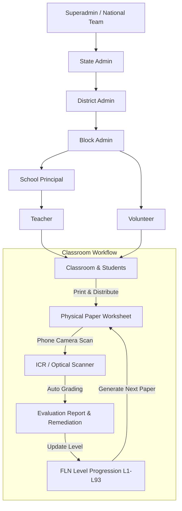

# FLN Platform Contributor Onboarding & Technical Proposal

**Contributor**: Subhajit Samajpati  
**Role**: Software Engineering Contributor  
**Repository**: [Vicharanashala FLN Platform](https://github.com/vicharanashala/fln)  
**Submission Date**: August 2026  

---

## 1. What is FLN?

**FLN** stands for **Foundational Literacy and Numeracy**. In Indian school education (under national guidelines like the NIPUN Bharat Mission), FLN refers to the essential reading and basic math skills that children need to master by Grade 3. If a child falls behind in these early years, they struggle with almost every subject later on. This repository focuses specifically on the **foundational mathematics** side for kids from Preschool 1 up to Class 4 (Stages 1 through 7, roughly ages 3 to 9+).

### The Educational Problem It Solves
The main issue in primary classrooms is that **students are rarely at the same learning level**:
1. **Different Starting Points**: In a single Class 2 or Class 3 classroom, one child might still be learning basic single-digit counting, while another is already comfortable with two-digit addition. If a teacher gives everyone the exact same worksheet, the struggling kids fall further behind and the advanced kids get bored.
2. **Teachers Have Limited Time**: In many government primary schools, a single teacher has to teach multiple grades in the same classroom. Making custom worksheets and grading dozens of papers by hand every day is just not practical without software help.
3. **No Screens in the Classroom**: Students in these schools do not have laptops or tablets. **All the actual learning and test-taking has to happen on physical paper sheets.** The software's job is to handle the background work: creating custom test papers, printing them out, scanning the answers using a phone camera, and grading them automatically.

### The Purpose of the Platform
The platform gives teachers a practical way to teach each child according to their actual level:
- It tests each child to find their exact baseline on a 93-level math scale.
- It generates printable A4 PDF worksheets tailored to each student's current weak spots.
- It lets teachers take a photo of the completed paper, reads the handwritten answers using an optical scanner (ICR), and grades it automatically.
- It suggests the next level or remedial practice based on what the child missed.
- It gives school heads, block officers, and state coordinators clear summary reports on how their schools are progressing.

---

## 2. What do you understand by FLN as a system?

The platform connects students, teachers, school heads, and education administrators through a structured 7-tier role system that matches how Indian school administration works.

### Main Entities in the System

1. **Student** (`backend/src/db.ts`):
   - Represents an enrolled student with their name, class, section, numeric display ID, masked Aadhaar ID, and assigned school.
   - Tracks their math progress: `currentLevel` (1 to 93), `currentSubLevel` (0 for Core Mastery, 1 for Guided Remediation, 2 for Concrete Foundations), `targetLevel`, and a `levelHistory` array recording every past test placement.

2. **School** (`backend/src/db.ts`):
   - Represents a school with its state, district, and block codes.
   - Marked as `high` or `low` strength. High-strength schools have teachers who handle paper generation and scanning directly. Low-strength schools can be supported by roving block volunteers.

3. **User Roles & Permissions** (`backend/src/auth.ts`, `backend/src/db.ts`):
   - **Superadmin**: National administrators (IIT Ropar / Vicharanashala team) who manage the curriculum map, user accounts, and system-wide settings.
   - **State Admin**: Monitors district performance across their assigned state.
   - **District Admin**: Tracks block-level performance and school clusters.
   - **Block Admin**: Coordinates local schools and manages volunteers.
   - **School (Principal)**: Checks teacher assignments, class averages, and student placement certificates.
   - **Teacher**: Creates diagnostic papers, takes daily student attendance, scans completed answer sheets, and reviews test results.
   - **Volunteer**: Helps print papers and scan sheets in remote or low-connectivity schools.

4. **Curriculum Framework & Competencies** (`backend/src/config/curriculumMap.ts`, `backend/src/competencyPrerequisites.ts`):
   - 93 FLN levels divided across 6 math strands: *Number Sense, Number Operations, Shapes & Geometry, Measurement, Patterns & Algebra, and Data Handling*.
   - Each level links to a specific concept ID (like `S1.1` to `S7.18`).
   - A dependency graph (`CONCEPT_PREREQUISITES`) connects concepts so that when a student fails a question, the system can trace back to the exact foundational skill they missed.

5. **Worksheets & Diagnostic Papers** (`backend/src/db.ts`, `backend/src/paperGenerator.ts`):
   - Printable question papers generated as standard A4 PDFs using Puppeteer, with QR codes and aligned answer boxes for easy scanning.

6. **Evaluation Reports** (`backend/src/db.ts`):
   - Generated after an answer sheet is scanned. Contains the child's score, per-question breakdown, skill ratings (*Strong*, *Satisfactory*, *Needs Practice*), and an explanation for why the child was placed at that level.

7. **Student Attendance Records** (`backend/src/routes/attendance.ts`):
   - Daily roll call tracking (*Present*, *Absent*, *Late*, *Excused*) per student and class, helping teachers see if poor test scores are linked to missed school days.

8. **Logbook Audit Trail** (`backend/src/routes/logbook.ts`):
   - An activity log recording when worksheets are downloaded, printed, or scanned, with role filtering and Excel export options.

---

## 3. Current State of the Repository — What Has Been Done So Far

### Tech Stack & Architecture
- **Frontend**: Single Page Application built with **React 19**, **TypeScript**, **Vite**, **Tailwind CSS v4**, and **Lucide React** icons. Uses **SheetJS (`xlsx`)** to generate formatted Excel files directly in the browser.
- **Backend**: Built with **Node.js** and **Express 4** in `backend/src/`, bundled using **esbuild**. Uses **JWT** tokens and **bcrypt** for authentication and role checks.
- **Database**: Connects to **MongoDB Atlas** for storing users, students, schools, test reports, attendance, and logs. It also has an automatic local JSON file fallback (`backend/data/`) so developers and testers can run the app offline without setting up a remote database.
- **AI & OCR Pipeline (`ai-services/`)**: Python scripts using OpenCV and PyMuPDF to crop answer boxes, filter pen ink, and read student handwriting, with fallbacks to the Gemini API for test generation and evaluation.

### Implemented Modules & Features
1. **Modular Backend Routes**: Backend routes are organized into clean files in `backend/src/routes/` (`auth`, `students`, `teachers`, `schools`, `classes`, `evaluation`, `diagnosticBulk`, `attendance`, `content`, `logbook`, `analytics`, `geo`).
2. **Dedicated Role Dashboards**: Separate dashboard components in `frontend/src/components/dashboards/` for Teachers, Volunteers, Principals, Admins, and Superadmins.
3. **Modular Panel Views**: Extracted panels in `frontend/src/components/panels/` for student lists, student profiles, diagnostic tests, worksheets, performance, reports, and system settings.
4. **Assessment & Grading Workflow**: Diagnostic paper generation, bulk student CSV upload, two-stage phone camera scanning, teacher override screens, and level progression logic.

---

## 4. Gaps Observed in the Code

During my review of the codebase, I identified five practical technical and product gaps:

### Gap 1: No Daily Student Attendance Tracking
- **Where**: `backend/src/routes/` and `frontend/src/components/panels/AttendancePanel.tsx` (lines 8–42).
- **What**: The repository only had a simple view that counted past diagnostic exams (`examAttendance`). There was no way for teachers to take daily classroom attendance (Present, Absent, Late, Excused) or view student attendance percentages.
- **Why it matters**: If a student is struggling with math assessments, teachers and principals could not tell whether the child has trouble understanding the concept or is simply missing too many classes. Daily attendance data is necessary to understand student learning loss.

### Gap 2: Curriculum Levels Were Just Static Files Without an In-App Viewer
- **Where**: `FLN Levels Structure/` (folder with 93 markdown directories) and `frontend/src/components/panels/ContentPanel.tsx` (lines 11–128).
- **What**: All 93 level descriptions and question bank data (`data/questionBank.json`) were sitting as static files on disk. The frontend `ContentPanel` only rendered plain cards with level titles, and clicking them did nothing. Teachers could not inspect what learning objectives, sub-levels (.0 Core, .1 Guided, .2 Concrete), or sample questions were included in each level.
- **Why it matters**: Teachers had to manually open raw files on their computers to see what each level covered before assigning worksheets to their students.

### Gap 3: Logbook Export Was Basic CSV Text and Role Checks Were Case-Sensitive
- **Where**: `backend/src/routes/logbook.ts` (lines 10–40) and `frontend/src/components/LogbookView.tsx` (lines 125–160).
- **What**: The export button downloaded raw, unformatted CSV text without custom columns or clean date formatting. In addition, role checks in `/api/logbook` used strict case-sensitive comparisons (`user.role === 'superadmin'`), which could fail if the token had slight casing differences.
- **Why it matters**: School administrators need readable Microsoft Excel (`.xlsx`) spreadsheets for reviews and reporting. Case-sensitive role checks could also accidentally block valid users from seeing their school logs.

### Gap 4: JWT Tokens Missed User Location Information
- **Where**: `backend/src/auth.ts` (lines 18–35) and `backend/src/routes/auth.ts` (lines 45–55).
- **What**: Login JWT tokens only included the user ID, email, and role, leaving out location fields like `stateCode`, `districtCode`, `blockCode`, and `schoolId`. As a result, the backend had to query the database on every single API request just to check where the user was assigned.
- **Why it matters**: This added unnecessary database lookups on every request and could cause session dropouts if MongoDB had a brief connection slowdown.

### Gap 5: No Error Boundary to Catch Component Crashes
- **Where**: `frontend/src/App.tsx` (lines 200–260) and `frontend/src/components/ErrorBoundary.tsx`.
- **What**: Dashboard panels were not wrapped in a React Error Boundary. If an unexpected error or missing property occurred in any sub-panel, the entire browser window crashed to a blank white screen.
- **Why it matters**: If a teacher running a classroom session hits an error in one panel, they should not get locked out of the whole application. The error should be caught so they can click "Reload View" or return to their main dashboard.

---

## 5. Ideas for the Project

Based on the gaps above, I designed and implemented five straightforward improvements:

### Idea 1: Daily Classroom Attendance Tracker with Class Filters and Excel Export
- **What**: A dedicated daily attendance screen where teachers can choose a date, pick their class and section, toggle student statuses (*Present*, *Absent*, *Late*, *Excused*), click "Mark All Present" for quick entry, and download an Excel sheet.
- **Why**: Gives teachers an easy way to take roll call in seconds and helps schools see if attendance drops are affecting student math progress.
- **How**: Built `backend/src/routes/attendance.ts` (with upsert operations to the MongoDB `attendance` collection) and created `frontend/src/components/AttendanceTracker.tsx`.

### Idea 2: Interactive 93-Level Content Library with Popup Modal
- **What**: An in-app curriculum explorer where teachers can search by strand or class, click any level card, and open a modal showing the full learning objectives, sub-level breakdown (.0, .1, .2), and sample questions from the question bank.
- **Why**: Helps teachers quickly review what each level covers before choosing worksheets for their students.
- **How**: Built `backend/src/routes/content.ts` to parse markdown files and question data, and created `frontend/src/components/LevelDetailModal.tsx` wired into `ContentPanel.tsx`.

### Idea 3: Formatted Excel (.xlsx) Export for Logbook and Attendance
- **What**: Upgraded data export from plain CSV text to real Microsoft Excel (`.xlsx`) files with auto-sized column widths, clean headers, and formatted timestamps using SheetJS (`xlsx`).
- **Why**: Produces clean, readable spreadsheets ready for administrative audits and state reporting.
- **How**: Added Excel generation in `frontend/src/components/LogbookView.tsx` and `frontend/src/components/AttendanceTracker.tsx`.

### Idea 4: Better JWT Token Scoping and Session Handling
- **What**: Included the user's school and location information directly in the signed JWT token, normalized role checks so they are not case-sensitive, and made sure user data falls back cleanly if MongoDB is temporarily offline.
- **Why**: Speeds up API checks, avoids redundant database queries on every request, and keeps teacher sessions working smoothly.
- **How**: Updated `backend/src/auth.ts`, `backend/src/routes/auth.ts`, and `backend/src/routes/logbook.ts`.

### Idea 5: React Error Boundary for Safer UI
- **What**: Wrapped dynamic dashboard panels in a type-safe React Error Boundary component that catches runtime errors and shows a friendly "Reload View" button instead of crashing to a blank screen.
- **Why**: Protects teachers from losing their active dashboard session if a minor rendering error occurs.
- **How**: Built `frontend/src/components/ErrorBoundary.tsx` and connected it inside `frontend/src/App.tsx`.

---

## 6. Your Contribution

During this onboarding and development cycle, I implemented, tested, and integrated the following features into the codebase:

### 1. Student Attendance Tracking Subsystem
- **Backend Endpoints** (`backend/src/routes/attendance.ts`):
  - `GET /api/attendance`: Fetches attendance filtered by date, school, class group, and section.
  - `POST /api/attendance/mark`: Saves or updates daily attendance records in MongoDB with in-memory fallback.
  - `GET /api/attendance/stats`: Calculates attendance rates, top attendees, and attendance-to-progress trends.
- **Frontend Interface** (`frontend/src/components/AttendanceTracker.tsx`):
  - Created a responsive roll-call table with a date picker, class/section dropdowns, one-click status toggles, a "Mark All Present" button, and an Excel (`.xlsx`) download option.
  - Connected it into `frontend/src/components/PanelViews.tsx` for teachers, school heads, and volunteers.

### 2. FLN Content Library & Level Detail Modal
- **Backend Content API** (`backend/src/routes/content.ts`):
  - `GET /api/content/levels`: Returns all 93 levels with strand, class, stage, and question counts.
  - `GET /api/content/levels/:levelId`: Reads and parses the markdown files from `FLN Levels Structure/` to return descriptions, objectives, and sub-levels.
  - `GET /api/content/levels/:levelId/questions`: Returns matching questions from `data/questionBank.json`.
- **Frontend Modal & Explorer** (`frontend/src/components/LevelDetailModal.tsx`, `frontend/src/components/panels/ContentPanel.tsx`):
  - Built an interactive modal with tabs for Overview, Learning Objectives, Sub-levels, and Question Bank preview.
  - Updated `ContentPanel.tsx` with strand filters, search, and click-to-open level inspection.

### 3. Excel (.xlsx) Export for Audit Logbook
- **Excel Export**: Integrated SheetJS (`xlsx`) in `frontend/src/components/LogbookView.tsx` to generate clean `.xlsx` spreadsheets with proper column widths and formatted dates.
- **Role Scoping**: Updated `backend/src/routes/logbook.ts` to use case-insensitive role checks and provided sample seed logs for testing.

### 4. Authentication Improvements & Error Boundary
- **JWT & Role Scoping**: Updated `backend/src/auth.ts` and `backend/src/routes/auth.ts` to include full user location metadata in JWT payloads and avoid unnecessary database lookups.
- **Error Boundary**: Created `frontend/src/components/ErrorBoundary.tsx` to catch sub-panel errors gracefully and prevent blank white screens in `frontend/src/App.tsx`.

### 5. Monorepo Quality Assurance & Build Verification
- Validated full TypeScript type safety across `@fln/frontend` and `@fln/backend` with zero compilation or lint errors (`npm run lint`).
- Verified production builds (`npm run build`) for both the frontend Vite bundle and the backend esbuild bundle.
