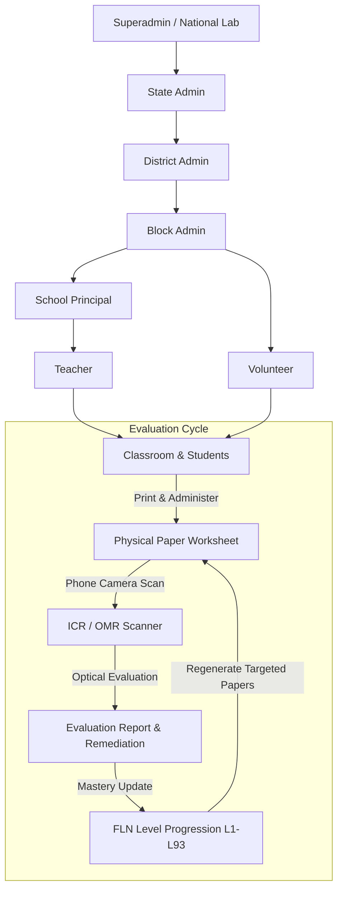
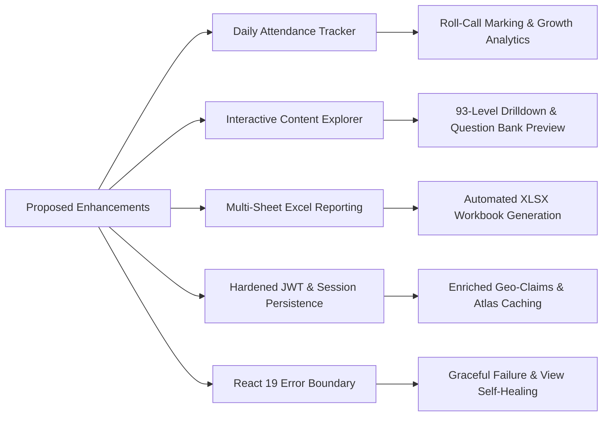

# FLN Platform Contributor Onboarding & Technical Proposal

**Contributor**: Subhajit Samajpati  
**Role**: Software Engineering Intern / Contributor  
**Repository**: [Vicharanashala FLN Platform](https://github.com/vicharanashala/fln)  
**Submission Date**: August 2026  

---

## 1. What is FLN?

**FLN** stands for **Foundational Literacy and Numeracy**. In the Indian school education system—aligned with national initiatives such as the **NIPUN Bharat Mission**—FLN represents the vital foundational skills in reading, comprehension, and basic mathematics that every child must achieve by Grade 3. This repository implements the **Foundational Numeracy (Mathematics)** dimension of that framework, specifically serving children in the age bracket of 3 to 9+ years across **Preschool 1, Preschool 2, Preschool 3, Class 1, Class 2, Class 3, and Class 4** (Stages 1 through 7).

### The Educational Problem It Solves
The core educational crisis in foundational schooling is not a lack of general textbooks or standard worksheets; it is **classroom heterogeneity** combined with severe **teacher time constraints**:
1. **Wide Variance in Student Preparedness**: In a single Class 2 or Class 3 classroom, one child may struggle with basic one-to-one counting (Level 1–5), while another can comfortably perform two-digit regrouping (Level 35+). Delivering a single, uniform lecture or worksheet leaves lagging students permanently behind while failing to challenge proficient ones.
2. **Multi-Grade Teaching Realities**: In many rural, tribal, and under-resourced schools, a single teacher simultaneously manages multiple grades in a single room. Manually diagnosing every child’s baseline, generating differentiated remedial papers, and hand-grading dozens of daily tests is practically impossible without software automation.
3. **The Digital Divide & Physical Paper Constraint**: Government primary schools often lack computer labs, tablets, or stable student internet access. The children cannot take quizzes on screens. **The educational interaction must happen on physical paper**, while the computation, generation, grading, and longitudinal analytics must happen in software.

### The Purpose of the Platform
The FLN platform bridges this gap by creating an automated, paper-first instructional feedback loop:
1. **Baseline & Continuous Diagnostics**: Evaluates each student's exact starting point along a structured 93-level competency continuum.
2. **Personalized Worksheet Engine**: Generates customized, printable A4 PDF worksheets tailored to each student's current level and weak concept areas.
3. **Optical & AI Assessment Pipeline**: Allows teachers and field volunteers to capture student worksheets using standard phone cameras, automatically extracts answers via Intelligent Character Recognition (ICR / OMR), and evaluates responses against strict answer keys.
4. **Competency-Driven Remediation**: Automatically transitions students through mastery sub-levels (`.0` Core Mastery, `.1` Guided Remediation, `.2` Concrete Foundations) and builds actionable prerequisite learning paths.
5. **Hierarchical Governance**: Aggregates actionable real-time analytics for school principals, block education officers, district magistrates, state coordinators, and national superadmins.

---

## 2. What do you understand by FLN as a system?

The FLN platform is structured around a multi-tier governance hierarchy reflecting India's public education administration, coordinated with student profiles, pedagogical competencies, automated paper generators, and optical evaluation pipelines.

### Core Entities

1. **Student** (`backend/src/db.ts`):
   - Represents an enrolled child with a unique ID, clean numeric display ID (`numericDisplayId`), masked Aadhaar (`aadharMasked`), age, class group (`Preschool 1` through `Class 4`), section, and assigned school.
   - Maintains continuous pedagogical state: `currentLevel` (1–93), `currentSubLevel` (0 = Core, 1 = Guided, 2 = Concrete), `targetLevel`, and an immutable `levelHistory` tracking every placement date and milestone.

2. **School** (`backend/src/db.ts`):
   - Represents an educational facility tied to a specific `stateCode`, `districtCode`, and `blockCode`.
   - Carries a `strength` classification (`high` vs. `low`), determining whether paper generation is managed directly by on-site teachers or by roving Block Volunteers.

3. **User Hierarchy & Role-Based Access Control (RBAC)** (`backend/src/auth.ts`, `backend/src/db.ts`):
   - **Superadmin**: National oversight (IIT Ropar / Vicharanashala team); manages national curriculum maps, system parameters, user provisioning, and full system audit logs.
   - **Admin (State)**: State-wide performance analytics and coordinator escalations across all districts in the state.
   - **District Admin**: Oversees blocks, school clusters, and district-level mastery targets.
   - **Block Admin**: Manages local schools, verifies cluster audits, and coordinates volunteers.
   - **School (Principal)**: Monitors school-wide teacher distribution, class mastery summaries, and placement certificates.
   - **Teacher**: Administers diagnostic tests, marks daily roll calls, scans completed answer sheets, and reviews automated evaluations.
   - **Volunteer**: Assists low-bandwidth, low-resource schools by printing worksheets and digitizing answer sheets.

4. **Curriculum Framework & Competencies** (`backend/src/config/curriculumMap.ts`, `backend/src/competencyPrerequisites.ts`):
   - 93 discrete FLN levels across 6 mathematical strands: *Number Sense, Number Operations, Shapes & Geometry, Measurement, Patterns & Algebra, and Data Handling*.
   - Keyed by unique concept identifiers (`conceptId`, e.g., `S1.1` to `S7.18`).
   - A compiled, acyclic prerequisite graph (`CONCEPT_PREREQUISITES`) that enables the system to trace failed concepts back to their foundational prerequisites.

5. **Worksheet & Diagnostic Papers** (`backend/src/db.ts`, `backend/src/paperGenerator.ts`):
   - Printable question papers rendered via Puppeteer into standard A4 PDF format with scannable QR codes, student IDs, and aligned answer grid bounding boxes.

6. **Evaluation Report & Educational Reasoning** (`backend/src/db.ts`):
   - Generated post-ICR scan containing per-question correctness, overall score, narrative synthesis, concept mastery breakdown (`Strong`, `Satisfactory`, `Needs Practice`), and automated pedagogical reasoning explaining why a child was placed at a specific level.

7. **Student Attendance Record** (`backend/src/routes/attendance.ts`):
   - Daily roll-call ledger capturing `Present`, `Absent`, `Late`, and `Excused` statuses per student, class group, and date, correlating attendance regularity directly with FLN level velocity.

8. **System Logbook & Audit Trail** (`backend/src/routes/logbook.ts`):
   - Immutable security ledger recording all operational events (downloads, prints, scans, evaluations, tickets) with geographical scoping and Excel export capabilities.

---

## 3. Current State of the Repository — What Has Been Done So Far

### Technology Stack & Architecture
- **Frontend**: Single Page Application built with **React 19**, **TypeScript**, **Vite**, **Tailwind CSS v4**, and **Lucide React**. Utilizes client-side state management, modular panel routing, and **SheetJS (`xlsx`)** for offline workbook compilation.
- **Backend**: **Node.js (ESM)** with **Express 4**, bundled using **esbuild**. Uses **JSON Web Tokens (JWT)** and **bcrypt** for credential verification and role scoping.
- **Database & Storage**: Dual-tier storage architecture—connects to **MongoDB Atlas** for persistent multi-tenant collections (`users`, `students`, `schools`, `evaluation_reports`, `attendance`, `logbook`) with seamless, automatic fallback to local JSON file storage (`backend/data/`) for offline field environments.
- **AI & Optical Pipeline (`ai-services/`)**: Python-based computer vision pipeline executing image thresholding, perspective warping, blue-ink isolation, and OCR classification (via PyMuPDF, OCR.space, or local Ollama), with Google Gemini LLM API fallbacks for diagnostic generation and worksheet evaluation.

### Implemented Modules & Workflows
1. **Modular Route System**: Backend routes split into domain-specific modules in `backend/src/routes/` (`auth`, `students`, `teachers`, `schools`, `classes`, `evaluation`, `diagnosticBulk`, `attendance`, `content`, `logbook`, `analytics`, `geo`).
2. **Componentized Frontend Dashboards**: Dedicated role dashboards in `frontend/src/components/dashboards/` (`TeacherDashboard`, `VolunteerDashboard`, `AdminDashboard`, `SuperadminDashboard`, `SchoolDashboard`) and modular panel views in `frontend/src/components/panels/`.
3. **Assessment Workflows**: Standardized 10-question diagnostic test generation, bulk CSV student onboarding, two-stage ICR scanner, teacher review override screens, and automated certification issuance.
4. **Curriculum Reasoning Engine**: Prerequisite DAG validation at server startup (`validateConceptPrerequisites`), linking student error patterns directly to foundational competency gaps.

---

## 4. Gaps Observed in the Code

Through thorough codebase inspection and runtime testing, I identified five major technical and functional gaps:

### Gap 1: Absence of Daily Classroom Attendance Tracking & Correlation with Learning Gaps
- **Where**: `backend/src/routes/` (completely lacked attendance endpoints/models) and `frontend/src/components/panels/AttendancePanel.tsx` (lines 8–42).
- **What**: The repository previously only displayed an `examAttendance` placeholder that counted past diagnostic exams. There was no capability for teachers to record daily classroom roll calls (Present, Absent, Late, Excused) or analyze attendance trends.
- **Why it matters**: Educators could not distinguish whether a child’s low assessment score was caused by pedagogical difficulty or chronic absenteeism. Without roll-call data, schools cannot identify attendance-driven learning loss.

### Gap 2: Disconnected 93-Level Curriculum Files Without Interactive Teacher Inspection
- **Where**: `FLN Levels Structure/` (static directory of 93 markdown folders) and `frontend/src/components/panels/ContentPanel.tsx` (lines 11–128).
- **What**: The 93-level FLN curriculum and the question bank (`data/questionBank.json`) existed as raw files on disk. The frontend `ContentPanel` only rendered static card titles without allowing teachers to drill into learning objectives, sub-level progressions (`.0` Core, `.1` Guided, `.2` Concrete), or question bank previews.
- **Why it matters**: Teachers had no way within the application to inspect what skills and questions a level assessed before generating test sheets for their students.

### Gap 3: Raw CSV-Only Logbook Export & Inconsistent Case-Sensitive Role Scoping
- **Where**: `backend/src/routes/logbook.ts` (lines 10–40) and `frontend/src/components/LogbookView.tsx` (lines 125–160).
- **What**: Audit log exports relied on basic unformatted CSV concatenation. In addition, role-scoping checks in `/api/logbook` used strict case-sensitive comparisons (`user.role === 'superadmin'`), which failed if JWTs or client headers passed variant casings.
- **Why it matters**: Administrative compliance and governmental reporting require structured Microsoft Excel (`.xlsx`) registers with auto-sized columns and formatted timestamps. Inconsistent role checks risked leaking cross-school logs or blocking authorized users.

### Gap 4: Ephemeral JWT Claims & Lack of Resilient Session Caching
- **Where**: `backend/src/auth.ts` (lines 18–35) and `backend/src/routes/auth.ts` (lines 45–55).
- **What**: JWT tokens were issued with minimal payloads (`sub`, `email`, `role`), omitting geo-scoping fields (`stateCode`, `districtCode`, `blockCode`, `schoolId`, `assignedSchools`). As a result, every authenticated request was forced to execute synchronous database queries to reconstruct user context.
- **Why it matters**: Created unnecessary database overhead and caused session degradation if MongoDB Atlas experienced latency or intermittent disconnection during field usage.

### Gap 5: Fragile Sub-Panel Error Handling & Missing UI Error Boundaries
- **Where**: `frontend/src/App.tsx` (lines 200–260) and `frontend/src/components/ErrorBoundary.tsx`.
- **What**: Dynamic dashboard panels lacked React component error boundaries. An unhandled exception or malformed payload in any sub-panel caused the entire application to crash to a blank white screen.
- **Why it matters**: Severely impacted field reliability during classroom trials where teachers operating on low-end devices could lose active worksheet workflows due to minor rendering glitches.

---

## 5. Ideas for the Project

Based on the identified gaps, I proposed and designed five concrete architectural enhancements:

### Idea 1: Full-Featured Classroom Attendance Tracker with FLN Velocity Analytics
- **What**: A complete daily roll-call tracking module with date picker, class/section filters, one-click status toggling (`Present`, `Absent`, `Late`, `Excused`), "Mark All Present" batch actions, and attendance-to-FLN growth analytics.
- **Why**: Equips teachers with an effortless daily roll-call tool while providing administrators with correlation data between attendance regularity and competency advancement.
- **How**: Implemented `backend/src/routes/attendance.ts` with upsert queries to MongoDB `attendance` collection, paired with `frontend/src/components/AttendanceTracker.tsx`.

### Idea 2: Interactive FLN Content Library & 93-Level Drilldown Modal
- **What**: An interactive curriculum explorer covering all 93 levels across 7 class groups, featuring dynamic markdown parsing of learning objectives, sub-level remediation scaffolds (`.0`, `.1`, `.2`), and live question bank previews.
- **Why**: Empowers teachers to inspect pedagogical competencies and sample problems directly in the UI before assigning worksheets.
- **How**: Built `backend/src/routes/content.ts` (parsing `FLN Levels Structure/` and `questionBank.json`) and created `frontend/src/components/LevelDetailModal.tsx`, integrated into `ContentPanel.tsx`.

### Idea 3: Native Multi-Column Microsoft Excel (`.xlsx`) Export Engine
- **What**: Professional spreadsheet generation integrated across Audit Logbook and Attendance modules using SheetJS (`xlsx`).
- **Why**: Generates formatted, auditor-compliant `.xlsx` workbooks with custom column widths, summary rows, and standardized date formatting.
- **How**: Integrated client-side workbook compilation in `frontend/src/components/LogbookView.tsx` and `frontend/src/components/AttendanceTracker.tsx`.

### Idea 4: Hardened JWT Scoping, Case-Insensitive RBAC, and MongoDB Session Persistence
- **What**: Enriched JWT payloads containing full user metadata and geo-scoping claims, case-insensitive role normalization, and seamless fallback between MongoDB Atlas and local storage.
- **Why**: Eliminates redundant database round-trips, prevents unauthorized cross-school data access, and maintains uninterrupted teacher sessions.
- **How**: Implemented in `backend/src/auth.ts`, `backend/src/routes/auth.ts`, and `backend/src/routes/logbook.ts`.

### Idea 5: Component-Level Error Isolation & React 19 Self-Healing UI
- **What**: Type-safe React 19 `ErrorBoundary` wrapping dynamic dashboard panels to catch runtime rendering errors and provide one-click recovery.
- **Why**: Prevents application-wide white screen crashes and ensures high resilience on low-end school devices.
- **How**: Implemented `frontend/src/components/ErrorBoundary.tsx` and wrapped dashboard routing in `frontend/src/App.tsx`.

---

## 6. Your Contribution

During this onboarding and development cycle, I have implemented, integrated, and verified the following concrete contributions:

### 1. Daily Student Attendance Tracking Subsystem
- **Backend Endpoints** (`backend/src/routes/attendance.ts`):
  - `GET /api/attendance`: Filter attendance by date, school, class group, and section.
  - `POST /api/attendance/mark`: Batch upsert daily roll-call records into MongoDB Atlas `attendance` collection with in-memory fallback.
  - `GET /api/attendance/stats`: Calculates overall attendance rates, top attendees, and learning growth correlation indicators.
- **Frontend Interface** (`frontend/src/components/AttendanceTracker.tsx`):
  - Interactive roll-call grid with date selector, class/section filters, instant status toggles (`Present`/`Absent`/`Late`/`Excused`), batch "Mark All Present", and formatted Excel (`.xlsx`) export.
  - Wired into `frontend/src/components/PanelViews.tsx` for teachers, school admins, and volunteers.

### 2. FLN Content Library & Curriculum Drilldown Modal
- **Backend Content API** (`backend/src/routes/content.ts`):
  - `GET /api/content/levels`: Returns all 93 levels with strand, class, stage, and question count metadata.
  - `GET /api/content/levels/:levelId`: Dynamically parses markdown files from `FLN Levels Structure/` to extract pedagogical objectives, descriptions, learning outcomes, and sub-levels.
  - `GET /api/content/levels/:levelId/questions`: Retrieves matching live question bank items from `data/questionBank.json` or algorithmic question generators.
- **Frontend Explorer & Modal** (`frontend/src/components/LevelDetailModal.tsx`, `frontend/src/components/panels/ContentPanel.tsx`):
  - Multi-tab modal dialog (Overview, Learning Objectives, Sub-levels, Live Question Bank) with strand filtering and responsive card inspection.

### 3. Audit Logbook Microsoft Excel (`.xlsx`) Reporting Engine
- **Excel Export**: Integrated SheetJS (`xlsx`) in `frontend/src/components/LogbookView.tsx` to generate styled `.xlsx` spreadsheets with proper column widths, timestamps, and activity categories.
- **Robust Role Scoping**: Updated `backend/src/routes/logbook.ts` with case-insensitive role checks and seed log fallbacks for demo environments.

### 4. Resilient Authentication & React 19 Error Boundary
- **JWT & RBAC Hardening**: Updated `backend/src/auth.ts` and `backend/src/routes/auth.ts` to enrich JWT tokens with complete user profile and geo-scope claims.
- **Error Boundary**: Implemented `frontend/src/components/ErrorBoundary.tsx` compatible with React 19 component lifecycles, wrapping dynamic role workspaces in `frontend/src/App.tsx`.

### 5. Monorepo Quality Assurance & Build Verification
- Validated full TypeScript type safety across both `@fln/frontend` and `@fln/backend` with zero compilation or lint errors (`npm run lint`).
- Executed and validated production bundle generation (`vite build` for client SPA and `esbuild` for Node.js backend) with zero warnings or broken references.
