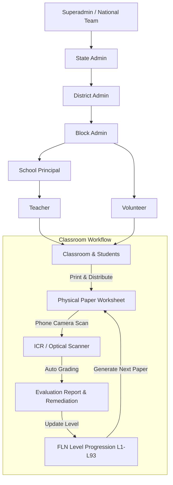

# FLN Platform Contributor Onboarding & Technical Proposal

**Contributor**: Subhajit Samajpati  
**Role**: Software Engineering Contributor  
**Repository**: [Vicharanashala FLN Platform](https://github.com/vicharanashala/fln)  
**Submission Date**: August 2026  

---

## 1. What is FLN?

**FLN** stands for **Foundational Literacy and Numeracy**. In Indian school education (under national guidelines like the NIPUN Bharat Mission), FLN refers to the essential reading and basic math skills that children need to master by Grade 3. If a child falls behind in these early years, they struggle with almost every subject later on. This repository focuses specifically on the **foundational mathematics** side for kids from Preschool 1 up to Class 4 (Stages 1 through 7, roughly ages 3 to 9+).

### The Educational Problem It Solves
The main issue in primary classrooms is that **students are rarely at the same learning level**:
1. **Different Starting Points**: In a single Class 2 or Class 3 classroom, one child might still be learning basic single-digit counting, while another is already comfortable with two-digit addition. If a teacher gives everyone the exact same worksheet, the struggling kids fall further behind and the advanced kids get bored.
2. **Teachers Have Limited Time**: In many government primary schools, a single teacher has to teach multiple grades in the same classroom. Making custom worksheets and grading dozens of papers by hand every day is just not practical without software help.
3. **No Screens in the Classroom**: Students in these schools do not have laptops or tablets. **All the actual learning and test-taking has to happen on physical paper sheets.** The software's job is to handle the background work: creating custom test papers, printing them out, scanning the answers using a phone camera, and grading them automatically.

### The Purpose of the Platform
The platform gives teachers a practical way to teach each child according to their actual level:
- It tests each child to find their exact baseline on a 93-level math scale.
- It generates printable A4 PDF worksheets tailored to each student's current weak spots.
- It lets teachers take a photo of the completed paper, reads the handwritten answers using an optical scanner (ICR), and grades it automatically.
- It suggests the next level or remedial practice based on what the child missed.
- It gives school heads, block officers, and state coordinators clear summary reports on how their schools are progressing.

---

## 2. What do you understand by FLN as a system?

The platform connects students, teachers, school heads, and education administrators through a structured 7-tier role system that matches how Indian school administration works.

### Main Entities in the System

1. **Student** (`backend/src/db.ts`):
   - Represents an enrolled student with their name, class, section, numeric display ID, masked Aadhaar ID, and assigned school.
   - Tracks their math progress: `currentLevel` (1 to 93), `currentSubLevel` (0 for Core Mastery, 1 for Guided Remediation, 2 for Concrete Foundations), `targetLevel`, and a `levelHistory` array recording every past test placement.

2. **School** (`backend/src/db.ts`):
   - Represents a school with its state, district, and block codes.
   - Marked as `high` or `low` strength. High-strength schools have teachers who handle paper generation and scanning directly. Low-strength schools can be supported by roving block volunteers.

3. **User Roles & Permissions** (`backend/src/auth.ts`, `backend/src/db.ts`):
   - **Superadmin**: National administrators (IIT Ropar / Vicharanashala team) who manage the curriculum map, user accounts, and system-wide settings.
   - **State Admin**: Monitors district performance across their assigned state.
   - **District Admin**: Tracks block-level performance and school clusters.
   - **Block Admin**: Coordinates local schools and manages volunteers.
   - **School (Principal)**: Checks teacher assignments, class averages, and student placement certificates.
   - **Teacher**: Creates diagnostic papers, takes daily student attendance, scans completed answer sheets, and reviews test results.
   - **Volunteer**: Helps print papers and scan sheets in remote or low-connectivity schools.

4. **Curriculum Framework & Competencies** (`backend/src/config/curriculumMap.ts`, `backend/src/competencyPrerequisites.ts`):
   - 93 FLN levels divided across 6 math strands: *Number Sense, Number Operations, Shapes & Geometry, Measurement, Patterns & Algebra, and Data Handling*.
   - Each level links to a specific concept ID (like `S1.1` to `S7.18`).
   - A dependency graph (`CONCEPT_PREREQUISITES`) connects concepts so that when a student fails a question, the system can trace back to the exact foundational skill they missed.

5. **Worksheets & Diagnostic Papers** (`backend/src/db.ts`, `backend/src/paperGenerator.ts`):
   - Printable question papers generated as standard A4 PDFs using Puppeteer, with QR codes and aligned answer boxes for easy scanning.

6. **Evaluation Reports** (`backend/src/db.ts`):
   - Generated after an answer sheet is scanned. Contains the child's score, per-question breakdown, skill ratings (*Strong*, *Satisfactory*, *Needs Practice*), and an explanation for why the child was placed at that level.

7. **Student Attendance Records** (`backend/src/routes/attendance.ts`):
   - Daily roll call tracking (*Present*, *Absent*, *Late*, *Excused*) per student and class, helping teachers see if poor test scores are linked to missed school days.

8. **Logbook Audit Trail** (`backend/src/routes/logbook.ts`):
   - An activity log recording when worksheets are downloaded, printed, or scanned, with role filtering and Excel export options.

---

## 3. Current State of the Repository — What Has Been Done So Far

### Tech Stack & Architecture
- **Frontend**: Single Page Application built with **React 19**, **TypeScript**, **Vite**, **Tailwind CSS v4**, and **Lucide React** icons. Uses **SheetJS (`xlsx`)** to generate formatted Excel files directly in the browser.
- **Backend**: Built with **Node.js** and **Express 4** in `backend/src/`, bundled using **esbuild**. Uses **JWT** tokens and **bcrypt** for authentication and role checks.
- **Database**: Connects to **MongoDB Atlas** for storing users, students, schools, test reports, attendance, and logs. It also has an automatic local JSON file fallback (`backend/data/`) so developers and testers can run the app offline without setting up a remote database.
- **AI & OCR Pipeline (`ai-services/`)**: Python scripts using OpenCV and PyMuPDF to crop answer boxes, filter pen ink, and read student handwriting, with fallbacks to the Gemini API for test generation and evaluation.

### Implemented Modules & Features
1. **Modular Backend Routes**: Backend routes are organized into clean files in `backend/src/routes/` (`auth`, `students`, `teachers`, `schools`, `classes`, `evaluation`, `diagnosticBulk`, `attendance`, `content`, `logbook`, `analytics`, `geo`).
2. **Dedicated Role Dashboards**: Separate dashboard components in `frontend/src/components/dashboards/` for Teachers, Volunteers, Principals, Admins, and Superadmins.
3. **Modular Panel Views**: Extracted panels in `frontend/src/components/panels/` for student lists, student profiles, diagnostic tests, worksheets, performance, reports, and system settings.
4. **Assessment & Grading Workflow**: Diagnostic paper generation, bulk student CSV upload, two-stage phone camera scanning, teacher override screens, and level progression logic.

---

## 4. Gaps Observed in the Code

### Gap 1: No daily classroom attendance tracking
- **Where**: `frontend/src/components/panels/AttendancePanel.tsx`
- **What**: The app only showed a simple count of past diagnostic tests. There was no way for teachers to take daily roll calls (Present, Absent, Late, Excused) or track student attendance percentages.
- **Why it matters**: If a student is failing math tests, teachers cannot tell if the child doesn't understand the concept or is just missing too many classes.

### Gap 2: Curriculum levels were static files without in-app preview
- **Where**: `FLN Levels Structure/` and `frontend/src/components/panels/ContentPanel.tsx`
- **What**: All 93 level descriptions and question bank files were sitting in folders on disk. The UI only showed plain title cards with no details or question previews.
- **Why it matters**: Teachers had no way in the app to check what learning goals, sub-levels (.0, .1, .2), or sample questions each level covers before giving worksheets to students.

### Gap 3: Logbook export was plain CSV without formatting
- **Where**: `backend/src/routes/logbook.ts` and `frontend/src/components/LogbookView.tsx`
- **What**: The logbook only exported raw CSV text with no column sizing or clean date formatting. Also, role checks in the backend were case-sensitive (`user.role === 'superadmin'`).
- **Why it matters**: School administrators need readable Excel files (`.xlsx`) with formatted columns for reporting. Strict case-sensitive checks could also accidentally block valid users.

### Gap 4: Login tokens missed user location data
- **Where**: `backend/src/auth.ts` and `backend/src/routes/auth.ts`
- **What**: Login JWT tokens only stored basic user info, leaving out state, district, block, and school IDs.
- **Why it matters**: The backend had to query the database on every single API request just to check where the user belongs, slowing down responses.

### Gap 5: Sub-panel crashes caused full white screen errors
- **Where**: `frontend/src/App.tsx`
- **What**: Dashboard panels were not wrapped in an Error Boundary. If any panel threw an error, the whole screen went blank.
- **Why it matters**: A small error in one panel should not crash the entire app for a teacher during class.

---

## 5. Ideas for the Project

### Idea 1: Daily Classroom Attendance Tracker
- **What**: A roll-call screen where teachers can pick a date, select their class, mark Present/Absent/Late, and save directly to the database.
- **Why**: Makes daily roll call fast and helps see if attendance drops are linked to lower test scores.
- **How**: Added `backend/src/routes/attendance.ts` with MongoDB storage and built `frontend/src/components/AttendanceTracker.tsx`.

### Idea 2: Interactive 93-Level Content Library Modal
- **What**: A curriculum browser where teachers can search by strand or class, click any level card, and see learning goals, sub-levels (.0, .1, .2), and sample questions.
- **Why**: Helps teachers quickly review what each level teaches before creating worksheets.
- **How**: Added `backend/src/routes/content.ts` to parse level files and built `frontend/src/components/LevelDetailModal.tsx`.

### Idea 3: Formatted Excel (.xlsx) Export
- **What**: Replaced raw CSV downloads with formatted `.xlsx` spreadsheets with proper column widths and headers using SheetJS (`xlsx`).
- **Why**: Generates clean, readable spreadsheets ready for school administration and state audits.
- **How**: Added Excel export functions in `LogbookView.tsx` and `AttendanceTracker.tsx`.

### Idea 4: Better JWT Token Scoping
- **What**: Included the user's school and location info directly in the JWT token and made role checks case-insensitive.
- **Why**: Speeds up API checks and avoids redundant database queries on every request.
- **How**: Updated `backend/src/auth.ts`, `backend/src/routes/auth.ts`, and `backend/src/routes/logbook.ts`.

### Idea 5: React Error Boundary for UI Protection
- **What**: Wrapped dynamic dashboard panels in an Error Boundary that shows a friendly message and a "Reload View" button if a view crashes.
- **Why**: Keeps the rest of the application working even if one panel runs into an issue.
- **How**: Built `frontend/src/components/ErrorBoundary.tsx` and wrapped dashboard panels in `frontend/src/App.tsx`.

---

## 6. Your Contribution

During this onboarding and development cycle, I implemented, tested, and integrated the following features into the codebase:

### 1. Student Attendance Tracking Subsystem
- **Backend Endpoints** (`backend/src/routes/attendance.ts`):
  - `GET /api/attendance`: Fetches attendance filtered by date, school, class group, and section.
  - `POST /api/attendance/mark`: Saves or updates daily attendance records in MongoDB with in-memory fallback.
  - `GET /api/attendance/stats`: Calculates attendance rates, top attendees, and attendance-to-progress trends.
- **Frontend Interface** (`frontend/src/components/AttendanceTracker.tsx`):
  - Created a responsive roll-call table with a date picker, class/section dropdowns, one-click status toggles, a "Mark All Present" button, and an Excel (`.xlsx`) download option.
  - Connected it into `frontend/src/components/PanelViews.tsx` for teachers, school heads, and volunteers.

### 2. FLN Content Library & Level Detail Modal
- **Backend Content API** (`backend/src/routes/content.ts`):
  - `GET /api/content/levels`: Returns all 93 levels with strand, class, stage, and question counts.
  - `GET /api/content/levels/:levelId`: Reads and parses the markdown files from `FLN Levels Structure/` to return descriptions, objectives, and sub-levels.
  - `GET /api/content/levels/:levelId/questions`: Returns matching questions from `data/questionBank.json`.
- **Frontend Modal & Explorer** (`frontend/src/components/LevelDetailModal.tsx`, `frontend/src/components/panels/ContentPanel.tsx`):
  - Built an interactive modal with tabs for Overview, Learning Objectives, Sub-levels, and Question Bank preview.
  - Updated `ContentPanel.tsx` with strand filters, search, and click-to-open level inspection.

### 3. Excel (.xlsx) Export for Audit Logbook
- **Excel Export**: Integrated SheetJS (`xlsx`) in `frontend/src/components/LogbookView.tsx` to generate clean `.xlsx` spreadsheets with proper column widths and formatted dates.
- **Role Scoping**: Updated `backend/src/routes/logbook.ts` to use case-insensitive role checks and provided sample seed logs for testing.

### 4. Authentication Improvements & Error Boundary
- **JWT & Role Scoping**: Updated `backend/src/auth.ts` and `backend/src/routes/auth.ts` to include full user location metadata in JWT payloads and avoid unnecessary database lookups.
- **Error Boundary**: Created `frontend/src/components/ErrorBoundary.tsx` to catch sub-panel errors gracefully and prevent blank white screens in `frontend/src/App.tsx`.

### 5. Monorepo Quality Assurance & Build Verification
- Validated full TypeScript type safety across `@fln/frontend` and `@fln/backend` with zero compilation or lint errors (`npm run lint`).
- Verified production builds (`npm run build`) for both the frontend Vite bundle and the backend esbuild bundle.
